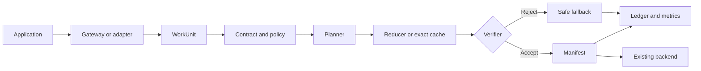

# Universal Reduction Plane

[](https://github.com/thewisecrab/urp/actions/workflows/ci.yaml)
[](https://thewisecrab.github.io/urp/)
[](https://github.com/thewisecrab/urp/security/code-scanning)
[](LICENSE)
[](pyproject.toml)
[](specs/openapi.yaml)

**One governed plane for reducing unnecessary data, transfer, and AI compute without silently changing the result.**

Universal Reduction Plane (URP) intercepts a data or AI work unit, assigns a
preservation contract, plans eligible reductions, verifies the candidate output,
records a manifest, and appends auditable ledger events.

```text
WorkUnit + Contract + Policy -> Plan -> Execute -> Verify -> Manifest + Ledger
```

[Read the technical paper](docs/WHITE_PAPER.md) | [Download the PDF](docs/assets/URP-White-Paper-v1.0.pdf) | [Review the arXiv bundle](paper/arxiv/README.md) | [Open the documentation](https://thewisecrab.github.io/urp/) | [Run the live proof](examples/live/README.md) | [Model your impact](examples/impact/README.md)

## Why URP exists

Infrastructure teams pay repeatedly for duplicate bytes, avoidable transfer,
identical model requests, repeated prompt context, inefficient data layouts, and
redundant training inputs. Existing optimizers address individual layers but rarely
share contracts, policy, verification, lineage, or audit evidence.

URP makes the reduction decision itself portable and reviewable.

- **Compatibility first:** S3-style objects, POSIX files, OpenAI-compatible AI,
  REST, protobuf, Python, TypeScript, Go, and Rust.
- **Exact by default:** unknown input receives an `exact_bytes` contract.
- **Verifier backed:** reduced or cached output is accepted only after a real
  verifier succeeds.
- **Tenant isolated:** cross-tenant cache and dedupe are disabled by default.
- **Policy gated:** semantic, approximate, lossy, and deletion paths are off until
  explicitly allowed.
- **Auditable:** manifests, hash-chained ledger events, traces, metrics, and
  redacted exports explain every decision.
- **Local first:** the full deterministic suite runs without cloud credentials or
  a paid model provider.

## Prove it locally

Requires Python 3.10 or newer.

```bash
git clone https://github.com/thewisecrab/urp.git
cd urp
python3 -m venv .venv
.venv/bin/python -m pip install --upgrade pip
.venv/bin/python -m pip install -e ".[dev]"

.venv/bin/urp --state-dir .urp-demo execute \
  --kind byte_object \
  --input "hello hello hello"

.venv/bin/python examples/live/run_live_examples.py --reset
.venv/bin/urp --state-dir .urp-bench benchmark run --suite local-all-v1
```

The live proof exercises exact object restore and range reads, legal-hold denial,
an OpenAI-compatible exact cache hit, a lakehouse adapter, savings metrics, redacted
manifest exploration, and ledger-chain verification.

## What the current evidence says

| Evidence class | Result | Interpretation |
|---|---:|---|
| Measured local fixture | 11,556 bytes restored exactly | Exact rehydration passed. |
| Measured local fixture | 249 bytes stored | 97.85% reduction on a deliberately repetitive CSV, not a universal ratio. |
| Measured mock AI path | 1 of 2 identical calls avoided | Exact cache returned the verified first response. |
| Measured policy path | Legal-hold deletion denied | The guardrail executed. |
| Measured audit path | Ledger chain valid | Event-chain verification passed. |
| Automated verification | 87 Python tests plus TypeScript, Go, Rust, schema, package, publication, and deployment gates | The local product contract is continuously checked. |

The checked-in base impact scenario models 100 TiB of storage, 200 TiB of monthly
transfer, and 10 million AI requests per month. Under its explicit assumptions it
calculates 1.5 million avoided model calls, 2.895 billion avoided tokens, $7,798.56
gross monthly direct savings, and $5,298.56 after a supplied URP operating cost.
That is a scenario, not a forecast.

```bash
.venv/bin/urp report impact \
  --scenario examples/impact/illustrative-portfolio.json
```

See [the technical paper](docs/WHITE_PAPER.md#10-reproducible-impact-model) for formulas,
low/base/high sensitivity, external context, and limitations.

## Architecture



The same lifecycle applies to byte objects, files, table snapshots, stream
segments, prompts, embeddings, agent steps, training datasets, and checkpoints.

## Capability map

| Surface | Implemented local behavior | Production extension |
|---|---|---|
| Core | WorkUnits, contracts, plans, verifiers, manifests, ledger, policies | Distributed stores and organization policy bundles |
| Objects | Exact chunking, compression, rehydration, range reads, multipart, legal hold | AWS S3 and provider object adapters |
| AI | Chat, completion, embeddings, exact cache, context compiler, router, fallback | OpenAI-compatible provider endpoint |
| Data | POSIX, SQL, lakehouse, stream, OTLP, vector, training contracts | Credentialed system adapters |
| Operations | Metrics, traces, reports, logs, approvals, backup/restore, readiness | Managed observability and secret stores |
| Deployment | Local, Docker Compose, Kubernetes, Helm, on-prem, edge | Cloud landing-zone integration |
| SDKs | Python CLI/runtime, TypeScript, Go, Rust crates | Published registries after release promotion |

## Safety defaults

| Behavior | Default |
|---|---|
| Unknown data | Preserve exact bytes |
| Cross-tenant cache or dedupe | Denied |
| Semantic cache | Disabled unless policy and verifier allow it |
| Approximate or lossy transform | Disabled unless bounded, approved, and verified |
| Deletion | Denied; legal hold always blocks |
| Cache store | Requires server-executed verification |
| Plugin | Requires digest, capabilities, and conformance |
| Failed optimization | Baseline fallback, never rejected output |
| API authentication | Required for `/v1/*` and `/metrics` |

## Run the services

Generate a local-only credential and start the control plane:

```bash
export URP_LOCAL_API_KEY="$(openssl rand -hex 32)"
.venv/bin/urp --state-dir .urp service run \
  --name control-plane \
  --listen 127.0.0.1:8080
```

In another shell:

```bash
curl http://127.0.0.1:8080/readyz
curl -H "Authorization: Bearer $URP_LOCAL_API_KEY" \
  http://127.0.0.1:8080/v1/manifests
```

Available service families are `control-plane`, `gateway-ai`, `gateway-s3`,
`worker`, and `scheduler`. See the [OpenAPI contract](specs/openapi.yaml) and
[deployment quickstart](docs/DEPLOYMENT_QUICKSTART.md).

## Deploy

### Docker Compose

```bash
cp .env.example .env
# Replace every CHANGE_ME value in .env.
docker compose -f deployments/docker-compose/docker-compose.yaml up --build
```

### Kubernetes with Helm

```bash
helm upgrade --install urp deployments/helm/urp \
  --namespace urp-system \
  --create-namespace \
  --set image.repository=ghcr.io/thewisecrab/urp \
  --set image.tag=0.1.0 \
  --set secrets.create=true \
  --set-string secrets.apiKey="$(openssl rand -hex 32)" \
  --set-string secrets.postgresDsn="postgresql://..."
```

Start in `observe` mode. Review [deployment boundaries](docs/DEPLOYMENT_QUICKSTART.md#production-boundaries)
before using `shadow` or `enforce`.

## SDK examples

TypeScript:

```ts
import { URPClient, WorkUnitBuilder } from "@thewisecrab/urp";

const client = new URPClient("http://127.0.0.1:8080", {
  apiKey: process.env.URP_API_KEY!,
});

const workUnit = new WorkUnitBuilder(
  "byte_object",
  "acme",
  "s3://logs/2026/07/11.jsonl",
)
  .payload("repeated data")
  .build();

const plan = await client.plan(workUnit);
```

Go:

```go
client := urp.NewAuthenticatedClient(
    "http://127.0.0.1:8080",
    os.Getenv("URP_API_KEY"),
    "acme",
)
workUnit, err := urp.ByteObjectWorkUnit(
    "acme",
    "s3://logs/object",
    "repeated data",
).Build()
if err != nil {
    return err
}
plan, err := client.Plan(ctx, workUnit)
```

## Verify the repository

```bash
make check

# Or run individual gates.
python3 -m pytest -q
python3 -m ruff check python tests
npm test --prefix typescript
(cd go && go test -race ./...)
cargo fmt --all -- --check
cargo clippy --workspace --all-targets -- -D warnings
cargo test --workspace
urp admin readiness
urp platform validate --target all
urp release verify --manifest PACKAGE_SHA256.json --root .
```

Cloud credentials are not required for these checks. Live readiness is explicit:

```bash
urp platform validate --target all --require-live
```

## Repository map

```text
python/urp/              Core runtime, CLI, services, policy, stores, adapters
crates/                  Rust core, chunker, and S3 gateway crates
go/                      Go SDK
typescript/              TypeScript SDK
services/                Runnable service boundaries and operations notes
specs/                   JSON Schema, OpenAPI, and protobuf contracts
plugins/                 Example classifiers, transforms, verifiers, adapters
tests/                   Unit, integration, conformance, load, benchmarks
deployments/             Docker, Compose, Kubernetes, Helm, Terraform, edge
examples/                Live proof, policies, impact scenarios, deployment use
docs/                    Architecture, security, API, deployment, technical paper
paper/arxiv/             Canonical arXiv metadata and submission checks
archive/source_packages/ Original source packages preserved for provenance
```

## Documentation

- [Start here](docs/00_START_HERE.md)
- [Product and use cases](docs/01_PRODUCT_EXPLAINER.md)
- [Architecture](docs/02_IDEAL_STATE_ARCHITECTURE.md)
- [WorkUnit and manifest model](docs/03_UNIFIED_WORK_UNIT_AND_MANIFEST_MODEL.md)
- [Algorithms](docs/04_REDUCTION_AND_AI_ALGORITHMS.md)
- [Adapter catalog](docs/05_ADAPTER_CATALOG_AND_COMPATIBILITY.md)
- [Policy, security, and compliance](docs/06_POLICY_SECURITY_COMPLIANCE.md)
- [APIs and protocols](docs/07_APIS_SCHEMAS_PROTOCOLS.md)
- [Operations and benchmarks](docs/09_OBSERVABILITY_BENCHMARKS_OPS.md)
- [Deployment quickstart](docs/DEPLOYMENT_QUICKSTART.md)
- [Platform readiness](docs/13_PLATFORM_READINESS.md)
- [Technical paper](docs/WHITE_PAPER.md)
- [arXiv submission bundle](paper/arxiv/README.md)
- [FAQ](docs/FAQ.md)

## Project status

URP is a pre-1.0 open-source reference implementation. The exact local paths,
interfaces, tests, and deployment packages are usable today. Production scale,
high availability, cloud landing zones, and workload-specific quality evaluation
remain adopter responsibilities and active engineering areas. See the
[roadmap](codex/ROADMAP_AND_TICKETS.md) and [paper limitations](docs/WHITE_PAPER.md#16-limitations-and-future-work).

## Contributing and security

Read [CONTRIBUTING.md](CONTRIBUTING.md), [GOVERNANCE.md](GOVERNANCE.md), and the
[Code of Conduct](CODE_OF_CONDUCT.md). Report vulnerabilities through GitHub
private vulnerability reporting as described in [SECURITY.md](SECURITY.md), not in
a public issue.

## Citation

Use [CITATION.cff](CITATION.cff) or cite the technical paper and the exact release tag.
The article is licensed under [CC BY 4.0](https://creativecommons.org/licenses/by/4.0/);
URP software is licensed under [Apache-2.0](LICENSE).
