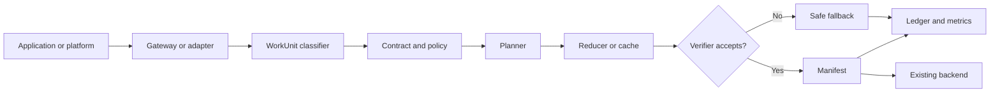

# Universal Reduction Plane

## A compatibility-first control plane for reducing data and AI waste

**White paper version:** 1.0  
**Publication date:** 2026-07-11  
**Project:** Universal Reduction Plane (URP)  
**Repository:** [github.com/thewisecrab/urp](https://github.com/thewisecrab/urp)  
**License:** Apache License 2.0  
**Evidence status:** local implementation verified; production outcomes require workload-specific measurement

**PDF edition:** [URP White Paper 1.0](assets/URP-White-Paper-v1.0.pdf)

## Abstract

Modern infrastructure pays repeatedly for the same bytes, the same data movement,
the same AI request, the same prompt context, and the same derived computation.
Point optimizers can reduce one category of waste, but they usually make decisions
through different interfaces, policy systems, observability stacks, and audit
records. This fragmentation makes optimization difficult to trust and difficult to
scale.

Universal Reduction Plane (URP) is an open-source, compatibility-first control and
execution plane for reducing unnecessary storage, transfer, and AI computation. It
does not claim that every input can be compressed. Instead, it gives every reducible
operation the same lifecycle:

```text
WorkUnit + Contract + Policy -> Plan -> Execute -> Verify -> Manifest + Ledger
```

The key idea is that reduction is acceptable only when the required contract is
preserved and the result is verified. Unknown data defaults to exact bytes.
Cross-tenant reuse is disabled. Semantic, approximate, lossy, and deletion paths
remain disabled unless explicit policy and verifier requirements are met.

The repository implements this model across an S3-compatible object path, POSIX
files, an OpenAI-compatible AI gateway, exact caches, context compilation, model
routing, scheduler hooks, lakehouse and training interfaces, SDKs, schemas,
deployment assets, metrics, manifests, and a hash-chained ledger. The deterministic
test suite requires no cloud credentials.

This paper explains the problem URP addresses, why a shared reduction plane changes
the economics and governance of optimization, how the current implementation works,
what its measured local evidence proves, and how to model potential impact without
confusing assumptions with production results.

## Executive answer

> URP solves the coordination problem behind infrastructure waste. It makes storage
> reduction, exact AI caching, context reduction, routing, and future reducers obey
> one contract, one policy decision, one verification standard, and one audit model.

URP can create large impact when three conditions are true:

1. A material fraction of bytes or compute is repeated or safely reducible.
2. Existing applications can keep their familiar S3, file, HTTP, and SDK interfaces.
3. Operators can prove that each optimization preserved the required outcome.

The implementation is designed around those conditions. It can first run in
`observe`, then `shadow`, then `enforce` mode. Exact paths are useful immediately.
Higher-risk paths require explicit policy and verifier evidence.

An included illustrative portfolio model uses 100 TiB of hot storage, 200 TiB of
monthly transfer, and 10 million monthly AI requests. Under the base assumptions,
it calculates:

- 30 TiB of storage and 60 TiB of transfer avoided per month;
- 1.5 million model calls avoided per month;
- 2.52 billion input and 375 million output tokens avoided per month;
- $7,798.56 gross monthly direct savings under the supplied unit rates;
- $5,298.56 net monthly savings after a supplied $2,500 URP operating cost;
- a 5.66-month simple payback on a supplied $30,000 implementation cost.

These are model outputs, not a URP forecast. The scenario is checked into the
repository and can be changed with one JSON file.

## 1. The problem: optimization is fragmented

Infrastructure waste is not one defect. It is a set of repeated decisions spread
across systems:

- object stores retain duplicate or highly compressible bytes;
- applications transfer data that could have been reduced earlier;
- AI clients repeat identical requests or send repeated context;
- model gateways route low-risk and high-risk work through the same expensive path;
- lakehouse jobs operate on inefficient file layouts;
- training pipelines ingest exact duplicate samples and checkpoints;
- schedulers run flexible work at expensive or constrained times;
- each optimizer writes different evidence, if it writes evidence at all.

The scale is large enough that efficiency is now a capacity issue, not only a cost
issue. The International Energy Agency reported that data centers consumed about
415 TWh in 2024 and projects about 945 TWh in 2030 in its base case. The same report
states that data center electricity consumption has grown around 12% per year since
2017. [IEA, Energy and AI](https://www.iea.org/reports/energy-and-ai/executive-summary)

For the United States, the Department of Energy reported 176 TWh of data center
electricity use in 2023 and a 2028 scenario range of 325 to 580 TWh, equal to about
6.7% to 12% of total US electricity. [US Department of Energy, 2024 data center energy report](https://www.energy.gov/articles/doe-releases-new-report-evaluating-increase-electricity-demand-data-centers)

The financial governance problem is converging with the technical problem. The
2026 State of FinOps report covers 1,192 respondents representing more than $83
billion in annual cloud spend. It reports that 98% now manage AI spend, up from 31%
two years earlier, and identifies AI cost management as the top skillset teams need
to develop. [FinOps Foundation, State of FinOps 2026](https://data.finops.org/)

These external numbers do not prove URP savings. They establish why a reusable,
measurable reduction mechanism matters.

## 2. Why point solutions are insufficient

A compressor can reduce bytes. A cache can avoid a model call. A scheduler can move
a job. None of those tools alone answers the system-level questions:

- What must remain unchanged?
- Which tenant owns the input and the result?
- Was the source still current when the cached output was used?
- Which policy allowed the action?
- Which verifier accepted it?
- Can the original bytes or logical result be reconstructed?
- What happened when verification failed?
- How much work was actually avoided?

Without common answers, an organization accumulates isolated optimizers and a new
governance burden. URP standardizes the decision and evidence layer while allowing
specialized reducers to remain pluggable.

## 3. The URP thesis

URP is a plane, not a new universal file format and not a model provider.

Every operation becomes a `WorkUnit`. A `Contract` defines what must remain true.
A planner selects eligible actions under policy. Execution produces candidate
outputs. Verifiers decide whether those outputs are acceptable. A `Manifest`
records physical representation and lineage. A `LedgerEvent` records the decision
history.



### 3.1 Canonical objects

| Object | Responsibility |
|---|---|
| `WorkUnit` | Identifies tenant, kind, logical reference, payload or payload reference, requested contract, namespace, policy context, and trace. |
| `Contract` | Defines preservation as exact bytes, exact logical equivalence, bounded approximation, semantic equivalence, or tombstone. |
| `Plan` | Lists ordered actions, required verifiers, expected benefit, fallback, and explainable score components. |
| `VerificationResult` | Records whether a named verifier accepted an actual candidate output and why. |
| `Manifest` | Maps the logical work unit to chunks, transforms, checksums, cache result, route, lineage, and telemetry. |
| `LedgerEvent` | Appends an auditable event for classification, policy, execution, verification, cache, restore, deletion, or override. |

### 3.2 Compatibility first

URP minimizes adoption cost through familiar boundaries:

- S3-style Put, Get, Head, list, delete, range read, and multipart operations;
- raw byte rehydration for exact object paths;
- POSIX file input and output;
- OpenAI-compatible chat, completion, embedding, and model endpoints;
- REST, OpenAPI, protobuf, CLI, Python, TypeScript, Go, and Rust surfaces;
- local, Docker Compose, Kubernetes, on-premises, edge, and cloud adapter profiles.

Applications do not need to understand chunk stores, manifests, or reduction
plugins to use the gateway path.

## 4. Why this architecture can change the economics

URP combines several effects that are normally optimized separately.

### 4.1 One observation layer finds compound waste

An object may be compressible, duplicated, repeatedly transferred, and repeatedly
included in AI context. Reducing only the stored copy leaves the other costs. A
shared manifest and metrics model can attribute avoided bytes and avoided compute
to the same logical source.

### 4.2 Verification turns optimization into a deployable control

The operational barrier to aggressive optimization is often trust. Exact restore
hashes, output shape checks, source fingerprints, policy IDs, and safe fallbacks let
teams expand only the paths that prove acceptable on their data.

### 4.3 Observe-shadow-enforce reduces adoption risk

URP can record what it would do before changing outputs. Shadow mode executes an
isolated candidate path and verifies it without serving that result. Enforce mode is
therefore a measured promotion, not a blind migration.

### 4.4 A stable plugin contract makes improvement cumulative

Compression, chunking, classifiers, verifiers, and provider adapters can improve
without replacing the WorkUnit, policy, manifest, ledger, or SDK model. New
optimizers inherit the same safety and conformance gates.

### 4.5 Unit economics become visible

The manifest and ledger make avoided work queryable by tenant, namespace, kind,
contract, route, and action. This is the bridge between engineering telemetry and
FinOps reporting.

## 5. Implementation

The repository is a working monorepo rather than an architecture-only proposal.

### 5.1 Core runtime

`python/urp` implements contracts, classification, entropy sampling, planning,
execution, exact rehydration, policies, verifiers, approvals, stores, metrics,
reports, gateways, adapters, service processes, backup and restore, and release
verification.

Exact object execution uses tenant-scoped content-defined chunks, checksums, and a
recorded compression codec. Every chunk is verified on read. Range rehydration
checks coverage and integrity instead of trusting manifest offsets.

Content addressing and duplicate coalescing are established storage techniques.
The Venti system demonstrated hash-addressed blocks and coalescing duplicate copies
as a storage primitive. URP extends the idea with tenant boundaries, contracts,
policy, restore verification, and a shared AI/data lifecycle. [Quinlan and Dorward,
Venti, FAST 2002](https://www.usenix.org/conference/fast-02/venti-new-approach-archival-data-storage)

### 5.2 Policy and security

The runtime includes:

- fail-closed API authentication;
- tenant-bound roles configured by the server;
- redacted viewer manifests;
- no cross-tenant cache or dedupe by default;
- signed, scoped, expiring approval records;
- legal-hold delete denial;
- policy-gated semantic and approximate actions;
- server-executed cache verification;
- capability-checked plugins;
- encrypted local envelopes using AES-256-GCM;
- safe, checksummed backup extraction;
- hash-chained ledgers and private local state files.

This is compatible with the direction of the NIST AI Risk Management Framework,
which organizes AI risk work around Govern, Map, Measure, and Manage. URP is not a
certification of NIST conformance, but its policy, measurement, evidence, and
fallback model gives operators implementation hooks for those functions. [NIST AI
RMF 1.0](https://www.nist.gov/publications/artificial-intelligence-risk-management-framework-ai-rmf-10)

### 5.3 Gateways and adapters

The local implementation includes:

- S3-compatible exact object operations and verified multipart uploads;
- OpenAI-compatible chat, completion, embeddings, and models;
- exact and semantic cache interfaces with persistent SQLite stores;
- context compiler and model router v0;
- SQL, lakehouse, stream, OTLP, training, vector, edge, and CI/CD contracts;
- opt-in AWS S3, Azure Blob, GCP Cloud Storage, PostgreSQL, and OpenAI-compatible HTTP adapters.

External credentials are not required for the default suite. Live adapters are
activated only when their environment and credentials are present.

### 5.4 SDK and protocol surface

JSON Schema Draft 2020-12, OpenAPI, and protobuf describe public contracts. The
TypeScript and Go SDKs provide authenticated clients, typed WorkUnit builders,
binary envelopes, raw-byte reads, approvals, manifests, ledgers, multipart object
operations, and AI helpers. Rust crates provide core contracts, chunking, and S3
gateway primitives.

### 5.5 Deployment and software supply chain

URP ships with a non-root, read-only container; Docker Compose; hardened Kubernetes
resources; Helm packaging; Terraform reference modules for AWS, Azure, and GCP;
on-premises and edge examples; health and readiness probes; CI; release digests;
and optional Ed25519 release signatures.

Release workflows generate artifacts, an SBOM, provenance, and GitHub artifact
attestations. GitHub describes attestations as signed claims linking artifacts to
their source repository, workflow, commit, and triggering event. Attestation proves
provenance, not that software is vulnerability-free. [GitHub artifact attestations](https://docs.github.com/en/actions/concepts/security/artifact-attestations)

## 6. Safety model

| Behavior | Default | Promotion requirement |
|---|---|---|
| Unknown input | Exact bytes | None |
| Exact compression | Allowed when planned | Exact restore verifier |
| Same-tenant exact cache | Allowed | Source fingerprints and output verifier |
| Cross-tenant reuse | Denied | No default promotion path |
| Semantic cache | Disabled | Explicit policy, scope, threshold, and semantic verifier |
| Bounded approximation | Disabled | Explicit error bound, policy, and measured verifier |
| Deletion | Denied | Explicit policy and approval; legal hold still blocks |
| Plugin action | Disabled until registered | Digest, capabilities, and conformance |
| Provider failure | Never accepted as optimized output | Safe baseline fallback |

The verifier is a result, not a client-supplied Boolean. Cached and reduced outputs
are accepted only after the server executes the required check.

## 7. Evidence method

URP uses three evidence classes.

### 7.1 Measured repository evidence

These results come from deterministic local examples and tests. They prove code
paths and invariants on small fixtures. They do not establish production throughput
or portfolio-wide savings.

### 7.2 Modeled scenario evidence

The impact calculator applies explicit workload, rate, reduction, operating-cost,
and implementation-cost assumptions. It is useful for sensitivity analysis and
deployment decisions. It is not a forecast.

### 7.3 External context

Primary reports and standards establish market scale, energy context, governance
needs, and prior technical foundations. They do not validate URP performance.

## 8. Measured local evidence

Run:

```bash
python3 examples/live/run_live_examples.py --reset
urp benchmark run --suite local-all-v1
python3 -m pytest -q
```

The current local evidence bundle demonstrates:

| Test | Observed result | What it proves |
|---|---:|---|
| Exact object restore | 11,556 of 11,556 bytes matched | Exact rehydration works for the fixture. |
| Stored representation | 249 bytes for a 11,556-byte repetitive CSV fixture | 97.85% reduction on this synthetic, highly compressible input only. |
| Byte-range read | Returned expected CSV prefix | Range reconstruction follows the verified manifest. |
| Legal hold | Delete denied with reason `legal_hold` | Policy guardrail is enforced. |
| Exact AI cache | First request `miss`, second request `exact_hit` | One of two identical mock-provider calls was avoided. |
| Prompt privacy | Raw prompt absent from default logs | Default logging uses redacted evidence. |
| Ledger | Chain validation returned true | Event-chain integrity checks pass for the run. |
| Lakehouse adapter | Local exact-logical execution accepted | Adapter contract runs without external services. |
| Full Python suite | 86 tests pass after this publication change | Unit, integration, conformance, security, gateway, load, and benchmark behavior remains green. |

The live runner emits machine-readable evidence for the same claims. In particular,
`object_gateway_exact.rehydrated_exact` records exact object reconstruction,
`ai_gateway_exact_cache.second_cache` records the repeated-request cache outcome,
and `lakehouse_mock_adapter.external_integrations_required` records whether that
adapter proof depended on an external service. The checked-in integration test
asserts these fields so documentation drift fails the release gate.

The local load suite also reports ingest rate, rehydration p95, AI gateway p95,
cache index operations, and manifest write rate. These values vary by machine and
fixture size. They are diagnostic smoke metrics, not production service-level
objectives.

## 9. Reproducible impact model

The model is implemented in `python/urp/impact.py`. The base scenario is
`examples/impact/illustrative-portfolio.json`.

```bash
urp report impact --scenario examples/impact/illustrative-portfolio.json
```

### 9.1 Base inputs

| Input | Assumption | Classification |
|---|---:|---|
| Hot object storage | 100 TiB | Assumed portfolio volume |
| Storage reduction | 30% | Assumed exact-safe rate |
| Storage price | $0.023/GiB-month | Illustrative rate; matches the published S3 Standard starting rate at publication time |
| Monthly data transfer | 200 TiB | Assumed portfolio volume |
| Transfer reduction | 30% | Assumed avoided charged transfer |
| Transfer price | $0.05/GiB | Illustrative blended rate |
| AI requests | 10,000,000/month | Assumed volume |
| Average tokens | 1,000 input, 250 output | Assumed request shape |
| Exact cache hit rate | 15% | Assumed measured-after-observe rate |
| Context compiler | 40% coverage, 30% input reduction | Assumed on uncached requests |
| AI token rates | $1/M input, $4/M output | Illustrative blended rates, not a provider quote |
| URP operating cost | $2,500/month | Assumed loaded cost |
| Implementation cost | $30,000 | Assumed one-time cost |
| Analysis horizon | 36 months | Assumed |

AWS publishes S3 Standard as starting at $0.023 per GB-month for the first pricing
tier, while actual rates vary by region, tier, contract, requests, and transfer.
[Amazon S3](https://aws.amazon.com/s3/)

### 9.2 Base outputs

| Output | Modeled result |
|---|---:|
| Storage avoided | 30,720 GiB/month |
| Charged transfer avoided | 61,440 GiB/month |
| Model calls avoided | 1,500,000/month |
| Input tokens avoided | 2,520,000,000/month |
| Output tokens avoided | 375,000,000/month |
| Total token avoidance | 23.16% |
| Storage cost avoided | $706.56/month |
| Transfer cost avoided | $3,072.00/month |
| AI token cost avoided | $4,020.00/month |
| Gross direct savings | $7,798.56/month |
| Net after supplied URP operating cost | $5,298.56/month |
| Annualized net | $63,582.72/year |
| Simple payback | 5.66 months |
| 36-month net value after implementation | $160,748.16 |

The model excludes semantic cache, model routing, training dedupe, request fees,
taxes, negotiated discounts, workload growth, and unmodeled operational costs. That
makes it narrower than the full URP opportunity but does not make it conservative
for every organization. Replace every assumption with observed telemetry before an
investment decision.

### 9.3 Sensitivity

The checked-in low, base, and high cases hold workload volume, unit prices, URP
operating cost, implementation cost, and horizon constant. They vary the assumed
reduction rates.

| Case | Storage / transfer reduction | Exact cache hit | Context coverage / reduction | Gross monthly | Net monthly | Payback |
|---|---|---:|---|---:|---:|---:|
| Low | 15% / 10% | 5% | 20% / 15% | $2,662.28 | $162.28 | 184.87 months |
| Base | 30% / 30% | 15% | 40% / 30% | $7,798.56 | $5,298.56 | 5.66 months |
| High | 45% / 40% | 25% | 60% / 40% | $11,955.84 | $9,455.84 | 3.17 months |

The low case is important: URP is not automatically economical. Observe-mode data
should determine whether a deployment has enough reducible work to justify its
operating and implementation cost.

## 10. Energy and capacity impact

Avoided storage, transfer, and model calls can reduce infrastructure work, but a
universal conversion from an avoided request to energy does not exist. Model,
hardware, batch size, utilization, provider overhead, cooling, location, and time
all matter.

URP therefore leaves energy unestimated by default. The impact scenario accepts
`energy_kwh_per_avoided_model_call` only when an operator has measured telemetry.
Carbon requires an additional location- and time-appropriate grid factor.

A global scale lens is still useful. Against the IEA projection of 945 TWh of data
center electricity in 2030:

- 0.01% equals 94.5 GWh;
- 0.1% equals 945 GWh;
- 1% equals 9.45 TWh.

This arithmetic is not an estimate of URP impact or addressable share. It shows why
small percentage improvements across large workloads can matter. URP's defensible
environmental claim is narrower: it measures avoided bytes, tokens, and model calls,
then lets operators apply workload-specific energy evidence.

## 11. How URP can create massive change

### 11.1 From hidden optimization to governed optimization

Optimization becomes an auditable platform capability instead of a collection of
opaque shortcuts. Security, platform, data, AI, and finance teams can inspect the
same plan, verifier, manifest, and ledger.

### 11.2 From isolated savings to compounding savings

One source object can drive storage, transfer, retrieval, prompt context, and
training costs. A shared lineage model can prevent repeated work at several stages,
not only one.

### 11.3 From provider lock-in to portable contracts

The value is defined by WorkUnits, contracts, policies, and evidence rather than a
specific cloud or model provider. Adapters can change while the governance model
remains stable.

### 11.4 From unsafe experimentation to staged rollout

Observe and shadow modes produce organization-specific evidence before enforcement.
This can shorten the path from optimization idea to production control while
keeping rollback and baseline fallback visible.

### 11.5 From cost reports to active unit economics

FinOps teams need usage and attribution before confident optimization. URP records
avoided work at the decision point, giving reports a direct link to technical
evidence.

## 12. Deployment path

### Phase 0: local proof

Run the live example, exact object benchmark, policy validation, and impact model.
Confirm that manifests, restores, ledger events, and reports are understandable.

### Phase 1: observe

Mirror selected object and AI metadata without serving reduced outputs. Measure:

- exact compression and duplicate opportunity;
- exact AI request repetition;
- context duplication;
- source-fingerprint stability;
- URP latency and operating cost;
- policy denials and verifier failures.

### Phase 2: shadow

Execute candidate exact paths in isolation. Compare restore hashes, provider
responses, latency, and failure behavior against the baseline.

### Phase 3: exact enforcement

Enable exact object compression, same-tenant exact cache, and low-risk context
compilation by namespace. Keep automatic fallback and continuously sample restores.

### Phase 4: platform expansion

Add production stores, cloud adapters, lakehouse workflows, training reduction, and
flexible scheduling. Introduce semantic or bounded approximation only through a
separate policy, approval, evaluation, and rollback process.

## 13. Deployment readiness and boundaries

The repository is ready for local evaluation, container build, Docker Compose,
Kubernetes/Helm installation, SDK integration, and adaptation behind conformance
tests. Cloud Terraform modules create or describe foundational storage and KMS
contracts, but they are reference modules rather than a complete production landing
zone.

Production operators still own:

- workload-specific capacity tests and service-level objectives;
- managed PostgreSQL and object-store topology;
- TLS, ingress, DNS, certificates, and network policy integration;
- secret-manager and workload-identity wiring;
- backup retention and disaster-recovery exercises;
- provider credentials, quotas, and legal terms;
- security review and compliance mapping;
- cost and energy telemetry from the actual environment.

The command `urp platform validate --require-live` reports missing credential gates
instead of pretending that an uncredentialed environment is live-ready.

## 14. Limitations

1. Current throughput results are local smoke measurements, not distributed scale tests.
2. Exact storage ratios depend entirely on data entropy and duplicate structure.
3. Exact AI cache hit rate depends on workload repetition and source stability.
4. Context reduction must be evaluated against task quality and policy.
5. Semantic, approximate, lossy, deletion, and distillation paths are not enabled by default.
6. Multi-region consensus and replicated chunk metadata require production-specific backends.
7. Provider-side cached-token billing can overlap with gateway savings and must be modeled carefully.
8. Energy and carbon impact require measured workload and grid telemetry.
9. The project is pre-1.0; public interfaces can evolve under documented migration rules.

## 15. Research and engineering agenda

- production traces for exact cache, context, and object opportunity distributions;
- large-object and concurrent gateway benchmarks;
- formal manifest invariants and property-based restore testing;
- distributed manifest and ledger implementations;
- confidential-computing and remote-attestation plugin paths;
- FOCUS-compatible cost export;
- model-provider energy telemetry adapters;
- task-specific semantic verifier suites;
- controlled trials comparing observe, shadow, and enforce outcomes;
- long-horizon restore drills across codec and plugin upgrades.

## 16. Conclusion

The opportunity behind URP is not a mythical universal compressor. It is a universal
way to decide whether work can be avoided, prove that the required result was
preserved, and record the outcome across data and AI systems.

That shared lifecycle can change how organizations optimize infrastructure. It
creates a path from scattered tools to one governed reduction plane; from estimated
savings to attributed avoided work; from risky shortcuts to verifier-backed
promotion; and from provider-specific controls to portable contracts.

The current repository proves the local product contract and supplies deployment,
SDK, policy, conformance, and release foundations. Its impact model shows that the
economics can be material under plausible assumptions and uneconomic under weak
ones. The correct next step for every adopter is therefore the same: deploy in
observe mode, measure the real opportunity, and enforce only what verification can
defend.

## Appendix A: impact formulas

```text
storage_avoided = storage_gib * storage_reduction_rate
storage_cost_avoided = storage_avoided * storage_cost_per_gib_month

transfer_avoided = monthly_transfer_gib * transfer_reduction_rate
transfer_cost_avoided = transfer_avoided * transfer_cost_per_gib

cached_calls_avoided = monthly_requests * exact_cache_hit_rate
cached_input_tokens = cached_calls_avoided * average_input_tokens
cached_output_tokens = cached_calls_avoided * average_output_tokens

context_input_tokens =
  (monthly_requests - cached_calls_avoided)
  * context_compiler_coverage
  * average_input_tokens
  * context_input_reduction_rate

ai_cost_avoided =
  (cached_input_tokens + context_input_tokens) / 1,000,000 * input_rate
  + cached_output_tokens / 1,000,000 * output_rate

gross_monthly_savings =
  storage_cost_avoided + transfer_cost_avoided + ai_cost_avoided

net_monthly_savings = gross_monthly_savings - monthly_urp_operating_cost
payback_months = implementation_cost / net_monthly_savings
```

## Appendix B: references

1. C. E. Shannon, "A Mathematical Theory of Communication," Bell System Technical Journal, 1948, [DOI 10.1002/j.1538-7305.1948.tb01338.x](https://doi.org/10.1002/j.1538-7305.1948.tb01338.x).
2. International Energy Agency, [Energy and AI](https://www.iea.org/reports/energy-and-ai), 2025.
3. US Department of Energy and Lawrence Berkeley National Laboratory, [2024 United States Data Center Energy Usage Report](https://energyanalysis.lbl.gov/publications/2024-lbnl-data-center-energy-usage-report), 2024.
4. FinOps Foundation, [State of FinOps 2026](https://data.finops.org/), 2026.
5. E. Tabassi, [Artificial Intelligence Risk Management Framework 1.0](https://doi.org/10.6028/NIST.AI.100-1), NIST AI 100-1, 2023.
6. S. Quinlan and S. Dorward, [Venti: A New Approach to Archival Data Storage](https://www.usenix.org/conference/fast-02/venti-new-approach-archival-data-storage), FAST 2002.
7. A. El-Shimi et al., [Primary Data Deduplication: Large Scale Study and System Design](https://www.usenix.org/conference/atc12/technical-sessions/presentation/el-shimi), USENIX ATC 2012.
8. IETF, [RFC 9110: HTTP Semantics](https://www.rfc-editor.org/rfc/rfc9110.html), 2022.
9. Amazon Web Services, [Amazon S3 pricing](https://aws.amazon.com/s3/pricing/), accessed 2026-07-11.
10. GitHub, [Artifact attestations](https://docs.github.com/en/actions/concepts/security/artifact-attestations), accessed 2026-07-11.
