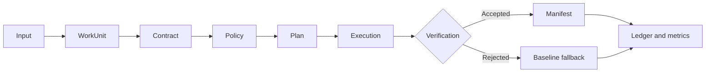

# Universal Reduction Plane

Universal Reduction Plane (URP) is an open-source, compatibility-first control and
execution plane for reducing unnecessary storage, data transfer, and AI compute.
It preserves application interfaces and requires verification before a reduced or
cached result is accepted.

```text
WorkUnit + Contract + Policy -> Plan -> Execute -> Verify -> Manifest + Ledger
```

## Start with a working proof

```bash
git clone https://github.com/thewisecrab/urp.git
cd urp
python3 -m venv .venv
.venv/bin/python -m pip install -e ".[dev]"
.venv/bin/python examples/live/run_live_examples.py --reset
```

The proof runs without cloud credentials. It demonstrates exact object restore,
range reads, legal-hold enforcement, an exact AI cache hit, a lakehouse adapter,
redacted manifests, savings metrics, and ledger-chain validation.

## The lifecycle



## What URP guarantees by default

- Unknown data stays exact.
- Tenants do not share cache or dedupe state.
- A client cannot declare its own role or verifier success.
- Exact outputs are checked before acceptance.
- Semantic, approximate, lossy, and deletion behavior is disabled until policy
  explicitly permits it.
- Failed candidate outputs fall back to the baseline path.
- Every accepted action produces lineage and audit evidence.

## Where to go next

| Goal | Read or run |
|---|---|
| Understand the product | [Product explainer](01_PRODUCT_EXPLAINER.md) |
| Evaluate the thesis and impact | [White paper](WHITE_PAPER.md) |
| Deploy locally or on Kubernetes | [Deployment quickstart](DEPLOYMENT_QUICKSTART.md) |
| Integrate an API or SDK | [API and protocols](07_APIS_SCHEMAS_PROTOCOLS.md) |
| Review security defaults | [Policy, security, and compliance](06_POLICY_SECURITY_COMPLIANCE.md) |
| Check platform boundaries | [Platform readiness](13_PLATFORM_READINESS.md) |
| Find a direct answer | [FAQ](FAQ.md) |

## Evidence, not universal claims

The included repetitive CSV fixture shrinks from 11,556 bytes to 249 bytes and
restores exactly. The repeated mock AI request avoids one of two provider calls.
Those results prove the paths, not production ratios.

Use the checked-in impact model with your own measured rates:

```bash
urp report impact --scenario examples/impact/illustrative-portfolio.json
```

The model reports gross and net impact, implementation payback, avoided bytes,
tokens, and calls, plus optional energy and carbon only when measured telemetry is
provided.
